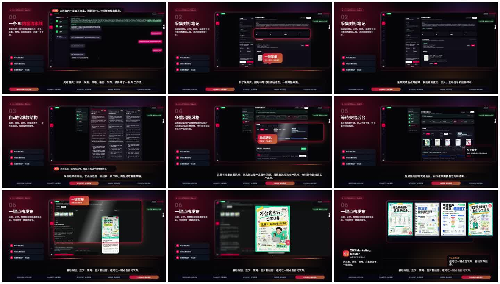
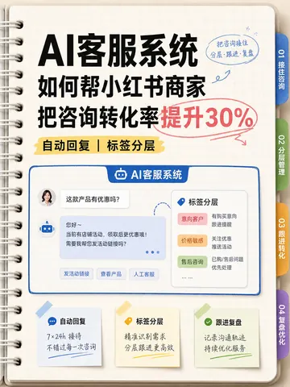

# xhs-marketing-master

**XHS AI Notes / 小红书 AI 笔记工具：AI-powered Rednote / Xiaohongshu marketing workspace for strategy, copywriting, image generation, browser extension workflows, and content operations.**

面向小红书运营、品牌营销和内容团队的 AI 增长工作台。

如果你在找“小红书笔记工具”“小红书 AI 写作工具”“小红书笔记生成器”或 “Rednote marketing tool”，这个项目提供的是一套更完整的开源工作台：不是只生成一段文案，而是把选题、对标、策略、标题正文、封面配图、采集发布和内容复盘串起来。

它把“小红书内容运营”里最耗时间的环节串成一条工作流：对标样本分析、产品卖点访谈、爆款策略生成、标题与正文创作、封面/配图生成、历史草稿管理，以及通过浏览器插件完成真实页面采集与发布前检查。

传统运营常常卡在三个地方：不知道选什么角度、写出来不像小红书、封面和配图跟不上内容节奏。这个项目的目标就是把这些工作系统化，让运营从“靠感觉写一篇”升级成“按策略生产、按样本校准、按结果复盘”。

English summary: this project is a public noncommercial snapshot of an AI notes and marketing workspace for Rednote/Xiaohongshu content teams. It combines XHS note generation, content strategy, benchmark note analysis, AI copywriting, AI image generation, browser-extension automation, and content asset management.

## 常见搜索词

小红书笔记工具、小红书 AI 笔记工具、小红书文案生成器、小红书笔记生成器、小红书运营工具、小红书自动化工具、小红书封面生成、小红书对标分析、Rednote AI notes、Xiaohongshu note generator、Xiaohongshu marketing tool、Rednote marketing automation。

## 它能解决什么问题

- **选题没方向**：围绕对标笔记、产品信息和目标人群，拆出更适合小红书语境的内容角度。
- **内容不像平台原生表达**：将产品卖点转成用户痛点、场景叙事、教程清单、避坑经验、对比测评等更容易被理解和收藏的结构。
- **标题和正文不稳定**：用多候选路线、策略裁判、结构化 guardrail 等方式提高成稿质量，减少空泛、跑题和短稿。
- **封面生产慢**：内置封面/配图生成与版式风格预览，让内容策略和视觉表达一起推进。
- **采集和发布链路割裂**：Web 负责策略和内容生产，浏览器扩展负责真实页面里的采集、登录检测和发布执行。
- **团队复盘难**：保留历史记录、草稿、产品档案、策略日志和任务状态，方便持续迭代内容资产。

## 真实演示

从产品访谈、对标采集、策略生成、多重出图到发布前整理，完整链路可以在一个工作台里完成。


[观看完整 63 秒演示视频](https://github.com/Yice-AI/xhs-marketing-master/releases/tag/demo-v1)



## 核心能力

### 1. 小红书策略引擎

系统不是简单让模型“写一篇文案”，而是先做策略拆解：从产品信息、对标样本、目标人群和运营目标中提炼内容原子，再生成多条候选路线。每条路线会包含标题方向、开头钩子、正文结构、产品植入方式、风险点和适配理由。

在成稿阶段，系统会通过候选裁判和质量检查机制筛选更稳的表达，尽量避免常见问题：标题党、正文太短、卖点堆砌、缺少场景、产品硬广感过强、结尾无法引导行动。

### 2. AI 生图与封面表达

除了文案，项目也覆盖封面和配图生产。你可以围绕不同内容策略生成适合小红书场景的视觉方向，例如强卖点封面、清爽信息流、手账笔记风、SaaS 功能卡片、运营流程图等。

视觉模块的重点不是“随机出图”，而是让图片服务于内容策略：标题、画面重点、产品场景、视觉层级和平台观感保持一致，让运营不用在文案工具和设计工具之间来回割裂。

### 3. 插件优先的真实页面工作流

采集和发布这类动作依赖真实浏览器环境。项目采用插件优先架构：Web 端负责策略、AI、历史记录和任务编排；浏览器扩展负责页面采集、登录状态检测、页面交互和发布执行。这样既保留自动化效率，也更贴近运营日常使用方式。

### 4. 内容资产沉淀

项目会把产品档案、创作草稿、策略结果、图片任务、采集记录和历史内容沉淀下来。对运营团队来说，这不是一次性的“生成器”，而是可以逐步积累的内容工作台。

## 视觉预览

以下是系统可生成的部分封面与版式效果示例，覆盖强卖点封面、清爽信息流、手账笔记风、SaaS 功能卡片和运营流程表达。

| Bold Cover | Clean Flow | Notebook Method |
| --- | --- | --- |
|  |  |  |

| SaaS Feature Cards | Handdrawn Operations |
| --- | --- |
|  |  |

## 适合谁

- 正在做小红书获客的 SaaS、AI 工具、教育、消费品和本地生活团队。
- 需要批量生产内容，但又不想牺牲选题质量和平台表达的运营团队。
- 想研究“小红书内容自动化、AI 生图、策略生成、浏览器插件协同”的开发者。
- 希望把运营经验沉淀成可复用工作流的独立开发者和增长团队。

## 关键词

小红书笔记工具、小红书 AI 笔记工具、小红书文案生成器、小红书笔记生成器、小红书运营工具、小红书自动化工具、小红书对标分析、小红书封面生成、Rednote AI notes、Rednote marketing tool、Xiaohongshu note generator、Xiaohongshu AI marketing、AI content strategy、AI copywriting、AI image generation、browser extension automation、content operations、marketing automation、growth workspace。

## 本地开发

```bash
npm install
python3 -m venv venv
./venv/bin/pip install -r backend/requirements.txt
cp .env.example .env

PYTHONPATH=. ./venv/bin/alembic upgrade head
PYTHONPATH=. ./venv/bin/uvicorn backend.api.main:app --reload --port 8000 --host 127.0.0.1
npm run dev -- --host 127.0.0.1
```

打开 http://127.0.0.1:3000/。

## 浏览器扩展

```bash
cd extension
npm install
cd ..
npm run extension:build
```

## 配置说明

公开版只提供 `.env.example`，需要复制为 `.env` 后填入你自己的模型服务地址和 API Key。

```bash
cp .env.example .env
```

生产环境配置、内部模型网关、云服务器部署脚本和远程执行器不会出现在公开仓库里。

> 这是从内部仓库导出的公开快照，已移除内部部署脚本、私有网关配置、内网 IP、生产环境变量、品牌素材和运行数据。

## Roadmap

- Public demo mode：提供更低门槛的演示数据和本地体验流程。
- English README：补充完整英文文档，方便海外开发者理解 Rednote/Xiaohongshu 场景。
- Docker quick start：降低本地试用和部署门槛。
- More visual templates：增加更多小红书封面、教程卡片、对比测评、SaaS 功能图模板。
- Strategy engine examples：沉淀更多产品类型的策略生成样例。

## 开源协议

本项目公开版采用 PolyForm Noncommercial License 1.0.0。

你可以用于个人学习、研究、评估和非商业用途。商业使用、SaaS 运营、代运营、转售、企业生产使用、包装成竞品或付费服务，都需要单独获得书面授权。

完整协议见 [LICENSE](LICENSE)。
